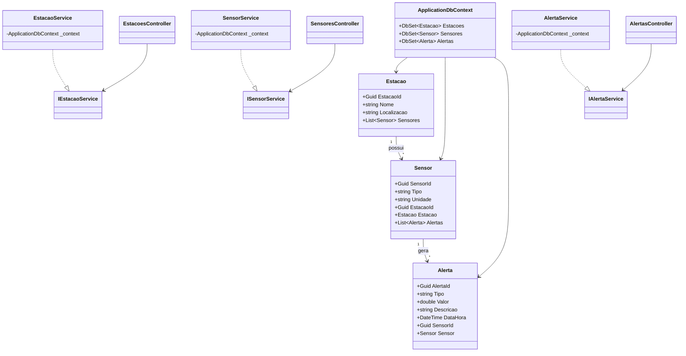

# 🌱 GreenAlert

## 📌 Sobre o Projeto

O **GreenAlert** é uma solução inteligente desenvolvida para modernizar a prevenção e o combate a incêndios florestais no Brasil, utilizando tecnologias de **IoT** e **análise de dados em tempo real**.

A proposta nasceu da necessidade urgente de enfrentar um problema recorrente e devastador: só em 2023, foram registrados mais de **185 mil focos de incêndio**, segundo o INPE, com impactos diretos na Amazônia, no Cerrado e em comunidades locais. Os prejuízos econômicos ultrapassam **R$ 2 bilhões por ano**, considerando custos com combate ao fogo, saúde pública e perdas no agronegócio.

O GreenAlert transforma o processo **reativo e manual** de detecção de incêndios em um **sistema automatizado, ágil e integrado**, capaz de:

- Detectar anomalias ambientais automaticamente com sensores IoT;
- Analisar dados em tempo real;
- Enviar **alertas imediatos** às equipes de resposta.

A aplicação é composta por:

- API RESTful desenvolvida em ASP.NET Core;
- Interface web baseada em Razor Pages;
- Camada de persistência com Entity Framework Core e banco de dados Oracle;
- Camada de domínio que centraliza regras de negócio.

---

## 🧑‍🚒 Público-Alvo

A solução é direcionada para:

- Brigadas florestais
- Corpos de bombeiros
- ONGs de preservação ambiental
- Gestores públicos (IBAMA, secretarias estaduais e municipais de meio ambiente)
- Propriedades rurais e empresas do setor agro

Ao utilizar o GreenAlert, essas instituições ganham maior capacidade de **monitoramento contínuo**, **resposta rápida** e **redução significativa das áreas afetadas**, inclusive em **regiões de difícil acesso**.

Estudos indicam que o uso de tecnologias preditivas como o GreenAlert pode **reduzir em até 40% os danos causados por incêndios florestais**, representando um avanço real na **proteção dos 60% do território nacional coberto por vegetação natural** (dados do IBGE e MapBiomas).

---

## 🔗 Rotas da API

### 🌡️ Sensores

| Método | Rota                      | Descrição                                  | Status HTTP Esperado          |
|--------|---------------------------|--------------------------------------------|------------------------------|
| GET    | `/api/sensores`           | Lista todos os sensores                     | 200 OK                       |
| GET    | `/api/sensores/{id}`      | Retorna sensor específico pelo ID          | 200 OK / 404 Not Found        |
| POST   | `/api/sensores`           | Cadastra um novo sensor                     | 201 Created / 400 Bad Request |
| PUT    | `/api/sensores/{id}`      | Atualiza sensor existente                   | 204 No Content / 400 / 404    |
| DELETE | `/api/sensores/{id}`      | Remove sensor                               | 204 No Content / 404          |

### 🏞️ Estações

| Método | Rota                      | Descrição                                  | Status HTTP Esperado          |
|--------|---------------------------|--------------------------------------------|------------------------------|
| GET    | `/api/estacoes`           | Lista todas as estações                     | 200 OK                       |
| GET    | `/api/estacoes/{id}`      | Retorna estação específica pelo ID         | 200 OK / 404 Not Found        |
| POST   | `/api/estacoes`           | Cadastra uma nova estação                   | 201 Created / 400 Bad Request |
| PUT    | `/api/estacoes/{id}`      | Atualiza estação existente                  | 204 No Content / 400 / 404    |
| DELETE | `/api/estacoes/{id}`      | Remove estação                              | 204 No Content / 404          |

### 🚨 Alertas

| Método | Rota                      | Descrição                                  | Status HTTP Esperado          |
|--------|---------------------------|--------------------------------------------|------------------------------|
| GET    | `/api/alertas`            | Lista todos os alertas                      | 200 OK                       |
| GET    | `/api/alertas/{id}`       | Retorna alerta específico pelo ID          | 200 OK / 404 Not Found        |
| POST   | `/api/alertas`            | Cadastra um novo alerta                     | 201 Created / 400 Bad Request |
| PUT    | `/api/alertas/{id}`       | Atualiza alerta existente                   | 204 No Content / 400 / 404    |
| DELETE | `/api/alertas/{id}`       | Remove alerta                               | 204 No Content / 404          |

---

## 📋 Pré-requisitos

- .NET SDK 7.0 ou superior
- Banco de dados Oracle 
- Ferramenta para testes de API (Postman, Swagger UI, etc.)

---

## ⚙️ Como Instalar e Rodar o Projeto

### 1. Clonar o Repositório

```bash
git clone [https://github.com/seuusuario/GreenAlert.git](https://github.com/leticia-zg/GreenAlert.git)
cd GreenAlert
```

### 2. Configurar o Banco de Dados Oracle

Edite o arquivo `appsettings.json` do projeto `GreenAlert.API` com a sua string de conexão:

```json
"ConnectionStrings": {
  "OracleConnection": "User Id=seu_usuario;Password=sua_senha;Data Source=//localhost:1521/XEPDB1;"
}
```

### 3. Aplicar Migrations e Iniciar a Aplicação

```bash
dotnet ef database update -p GreenAlert.Data -s GreenAlert.API
dotnet run --project GreenAlert.API
```

### 4. Acessar a Documentação Swagger

```bash
http://localhost:{porta}/swagger
```

### 5. Iniciar o Razor

```bash
dotnet run --project GreenAlert.MVC
```

### 6. Acessar o Razor

```bash
http://localhost:{porta}/Sensores
http://localhost:{porta}/Estacoes
http://localhost:{porta}/Alerta

```

---

## ✅ Exemplo de Fluxo

Cadastre uma estação:

```http
POST /api/estacoes
Content-Type: application/json

{
  "nome": "Estação Amazônia Norte",
  "localização": "Amazônia Norte"
}
```

Cadastre um dispositivo IoT (Sensor Ambiental):

```http
POST /api/sensores
Content-Type: application/json

{
  "tipo": "Temperatura",
  "unidade": "°C",
  "estacaoId": "COLE_AQUI_O_ID_DA_ESTACAO"
}
```

Cadastre um alerta

```http
POST /api/alertas
Content-Type: application/json

{
  "tipo": "Temperatura Elevada",
  "valor": 52.3,
  "descricao": "Temperatura crítica detectada pelo sensor",
  "sensorId": "COLE_AQUI_O_ID_DO_SENSOR"
}
```

---



---

📌 Autores:

- [Letícia Zago de Souza](https://www.linkedin.com/in/letícia-zago-de-souza)
- [Ana Carolina Reis Santana](https://www.linkedin.com/in/ana-carolina-santana-9a0a78232)
- [Celina Alcântara do Carmo](https://www.linkedin.com/in/celinaalcantara)


